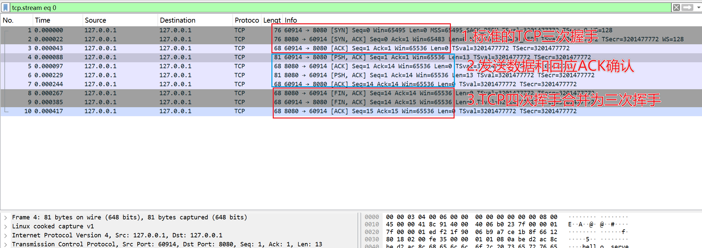
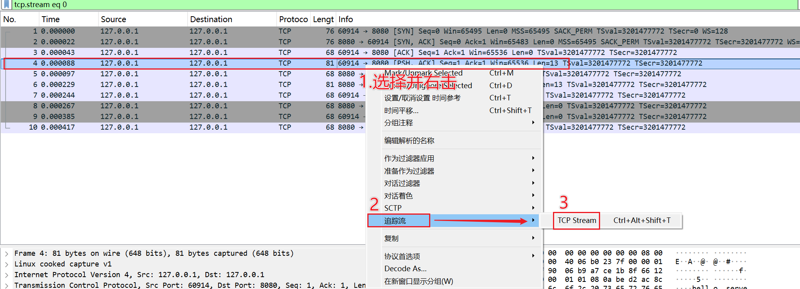
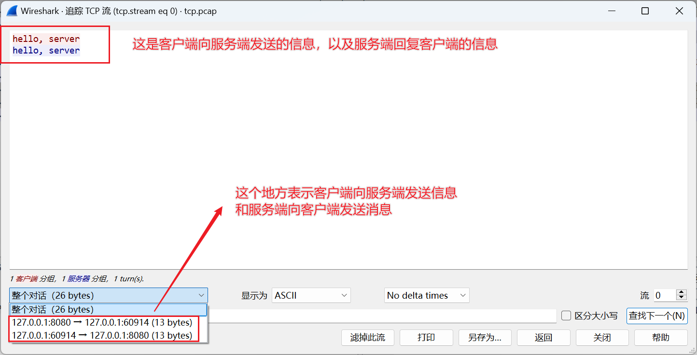
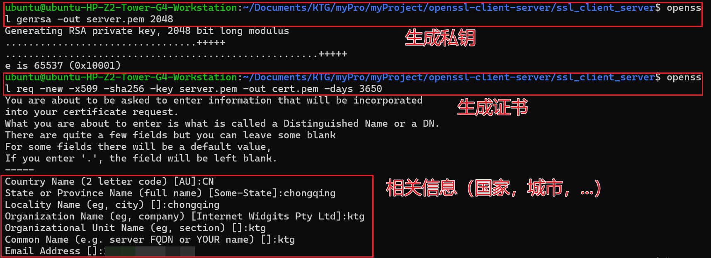
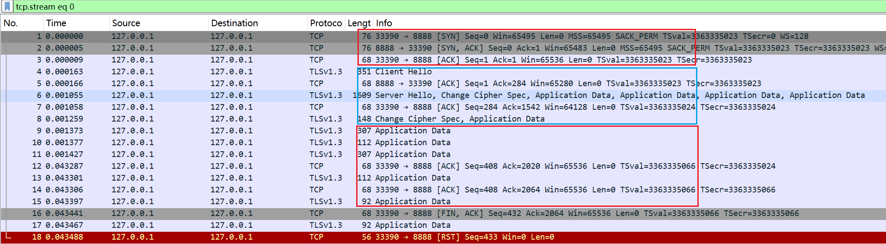
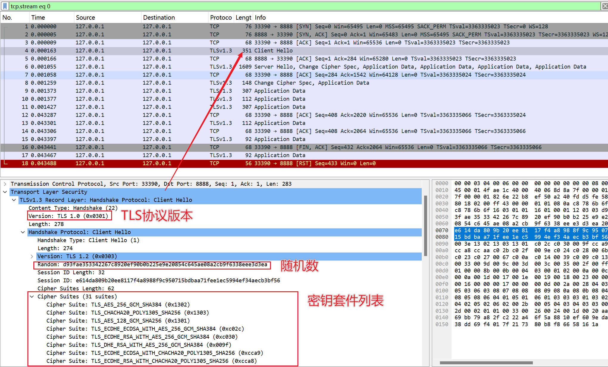
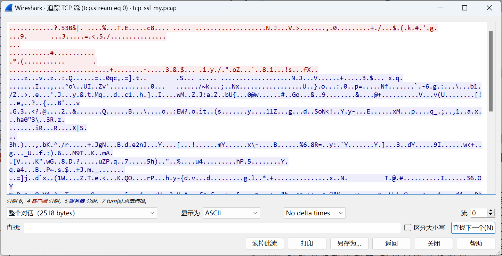

首先声明代码来源

[本项目simple-client-server代码来源1](https://space.bilibili.com/193137215?spm_id_from=333.788.upinfo.head.click)

[本项目ssl-client-server代码来源2](https://github.com/yedf2/openssl-example)

[整个项目代码讲解地址](https://blog.csdn.net/Keep_Trying_Go/article/details/150961257)

[本项目cpp-ssl-client-server代码来源3](https://github.com/youngyangyang04/Kama-HTTPServer)

compile
=================
```
OpenSSL VERSION OpenSSL 1.0.2p  14 Aug 2018

测试一：基于TCP协议的简单消息传输
cd simple_client_server
make

cd bin
./server #启动服务端
./client #启动客户端

测试二：基于TCP + SSL/TLS协议的加密消息传输
cd ssl_client_server
make

cd bin
./sync-ssl-svr [port] #同步方式的服务端启动
./sync-ssl-cli [IP] [port] #同步方式的客户端启动

./async-ssl-svr [port] #异步方式的服务端启动
./async-ssl-cli [IP] [port] #异步方式的客户端启动
```

Tcpdump抓包
================
```
sudo tcpdump -i any -w tcp.pcap -v host 127.0.0.1 and port 8080 and tcp #本项目使用的这一条就可以了

# 同时显示抓包信息到控制台
sudo tcpdump -i any -w tcp.pcap -v host 127.0.0.1 and port 8080 and tcp

# 限制抓包数量（例如只抓100个包）
sudo tcpdump -i any -w tcp.pcap -c 100 host 127.0.0.1 and port 8080 and tcp

# 指定网络接口（如只监控回环接口）
sudo tcpdump -i lo -w tcp.pcap host 127.0.0.1 and port 8080 and tcp
```
=================
|参数/表达式     |    说明                       |
|---------------|-------------------------------|
|sudo           |需要管理员权限才能捕获网络数据包  |
|tcpdump        |抓包工具命令                    |
|-i any         |监听所有网络接口（包括lo回环接口）|
|-w tcp.pcap    |将抓包数据保存到 tcp.pcap文件中  |
|host 127.0.0.1 |过滤主机IP为127.0.0.1（本地回环）|
|port 8080      |过滤端口为8080                  |
|tcp            |只捕获TCP协议的数据包            |
|-v             |显示抓包信息到控制台             |
|-c             |指定只抓100个包                 |
|lo             |指定网络接口（如只监控回环接口）  |

抓包流程
=================
* 开启第一个终端：首先启动服务器，比如./server
* 开启第二个终端：其次输入tcpdump抓包命令
* 开启第三个终端：最后启动客户端，比如./client


wireshark分析抓包
==============================
​
单纯基于TCP协议传输数据过程
------------------------------
​​
注：从TCP三次握手，然后进行数据传输以及ACK确认，到最后的TCP四次挥手合并为三次挥手，这个整个过程就是一个典型的TCP连接到数据传输以及断开连接的过程。


注：从抓包的内容来看，确实是首相客户端向服务端发送hello，server消息之后，其次服务端向客户端会送消息hello，server，由于是基于TCP数据传输，整个过程都是明文传输。

​
TCP协议 + SSL/TLS（安全套接层）协议
-------------------------------
OpenSSL​​ 是一个功能完备的、商业级的、开源的工具包，实现了 ​​SSL（Secure Sockets Layer）​​ 和 ​​TLS（Transport Layer Security）​​ 协议。它提供了一个强大的通用密码学库，用于保护网络通信的安全。

### 自签证书和正式证书有什么区别呢？

| 特性           | 自签证书                  | 正式证书（CA签发）            |
|---------------|-------------------------|-----------------------------|
| 签发机构       | 自己签发                 | 受信任的证书颁发机构（CA）     |
| 信任链         | 无第三方背书，需手动信任 | 自动嵌入浏览器/操作系统的信任链 |
| 加密强度       | 与正式证书相同           | 与自签证书相同               |
| 浏览器警告     | 显示"不安全"警告         | 显示绿色锁标志               |
| 有效期         | 可自定义（通常较长）     | 通常较短（如90天~1年）       |
| 适用场景       | 内部测试、开发环境       | 公网网站、商业服务           |


### 私钥和证书(自签证书)生成

```
# 生成私钥（保存为 .pem 格式）
openssl genrsa -out server.pem 2048
``` 
|参数	            | 说明                      |
|-------------------|--------------------------|
|genrsa	           |生成RSA私钥                 |
|-out server.pem	|指定输出文件为server.pem    |
|2048	           |密钥长度（位），推荐2048或4096|

```
# 生成自签名证书（保存为 .pem 格式）
openssl req -new -x509 -sha256 -key server.pem -out cert.pem -days 3650
```
|参数	          |          说明              |
|-----------------|---------------------------|
|req	          |证书请求和生成命令           | 
|-new	          |创建新证书请求               |
|-x509	          |生成自签名证书（而非证书请求）|
|-sha256	      |使用SHA-256哈希算法         |
|-key server.pem  | 指定使用的私钥文件          |
|-out cert.pem	  |输出证书文件                |
|-days 3650	      |证书有效期（10年）          |

```
# 查看证书信息（包含了签名算法，生成证书时填写的信息等）
openssl x509 -in cert.pem -noout -text
```
|参数	           |    说明                       |
|-----------------|-------------------------------|
|x509	          |  处理X.509证书                 |
|-in cert.pem	  | 指定输入证书文件                |
|-noout	          | 不输出证书本身（只输出解析信息） |
|-text	          |  以可读格式显示完整证书信息     |

### 私钥和证书授权
```
# 2. 设置证书权限
chmod 600 server.key
chmod 644 server.crt
```

### 验证密钥与证书是否匹配
```
验证密钥与证书是否匹配
openssl x509 -noout -modulus -in cert.pem | openssl md5
输出：(stdin)= 8b92476c6177fff45071d3c55b67b54b
openssl rsa -noout -modulus -in server.pem | openssl md5
输出：(stdin)= 8b92476c6177fff45071d3c55b67b54b
```

### 如果要对私钥加密的话
```
命令：openssl genrsa -aes256 -out server.pem 2048
提示：
Enter pass phrase for server.pem:  [输入密码]
Verifying - Enter pass phrase for server.pem:  [确认密码]

验证加密
命令：file server.pem  # 会显示"PEM RSA private key"
命令：openssl rsa -in server.pem -check  # 会提示输入密码

移除私钥密码
openssl rsa -in server.pem -out server_unencrypted.pem
```
|参数       |     作用  |
|-----------|----------|
|-aes256   |使用AES-256算法加密私钥（推荐）|
|-out server.pem |输出加密后的私钥文件 |
|2048      |RSA密钥长度（位） |
|其他加密算法：-des3，-camellia256|




### ​编程接口（API）​​OpenSSL 通常书写步骤：

* 初始化库​​：SSL_library_init()

* 创建上下文（CTX）​​：SSL_CTX_new()，用于存储全局设置和证书。

* 绑定 socket​​：将网络 socket 与 SSL 结构关联。

* ​执行 SSL/TLS 握手​​：SSL_connect()(客户端) 或 SSL_accept()(服务器)。

* ​安全通信​​：使用 SSL_read()和 SSL_write()替代普通的 read()和 write()。

* 清理​​：关闭连接并释放资源。

### 抓包结果

注：首先进行三次握手，其次是SSL/TLS四次握手，后面是发送，最后是断开连接

注：第一次握手的信息，关于SSL/TLS协议的四次握手过程网上有很多讲解，这里就不过多的赘述了。



参考链接
-----------------
[本项目代码来源](https://space.bilibili.com/193137215?spm_id_from=333.788.upinfo.head.click)

[抓包工具wireshark下载](https://blog.csdn.net/weixin_41287260/article/details/140937506)

[关于抓包工具Wireshark使用](https://blog.csdn.net/qq_39720249/article/details/128157288)

[基于TCP的四次挥手调用shutdown和close函数区别](https://blog.csdn.net/SteveForever/article/details/140638476)


